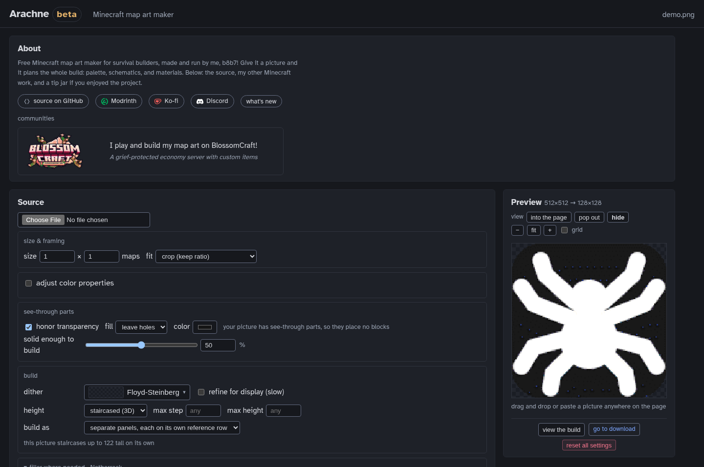

# Arachne

Minecraft map art maker and generator: image in, palette-optimized schematic out.
It runs entirely in your browser, and it is live at
**<https://b8b7.live/arachne/>**.

Arachne is in **beta**. The math is tested and the output is verified
in game. The remaining rough edges are mostly cosmetic.

## What it does

- Turns a picture into a map art schematic for survival or creative
  building, staircased or flat, from a single map up to a 16x16 grid.
- Prices every block choice by what it costs to build and tear down
  with the tools you carry: tier, Efficiency, Silk Touch, haste,
  flying, and whether the block drops itself when broken.
- Dithers with error diffusion (Floyd-Steinberg, Jarvis, Burkes,
  Stucki, Atkinson, Sierra Lite), ordered patterns, and color mixing
  based on [Joel Yliluoma's arbitrary-palette positional
  dithering](https://bisqwit.iki.fi/story/howto/dither/jy/). An
  optional refinement pass optimizes for viewing distance using the
  S-CIELAB perceptual metric of Zhang and Wandell (1996; [journal
  version](https://doi.org/10.1889/1.1985127)).
- Handles transparency the way the game does: holes place no blocks,
  and pixels along a transparency edge are quantized against the
  shades the game can render there.
- Counts the filler and noobline blocks a build needs alongside the
  art blocks, in the summary and on the build sheet, and lets you pick
  the filler block from a searchable, version-aware list.
- Targets any release from 1.13 to the current one. The palette, the
  blocks on offer, and the DataVersion your files carry all follow the
  release you pick.
- Exports a .litematic for Litematica, named so it shows under its own
  name in the schematic list, or a vanilla structure .nbt that
  Litematica and WorldEdit both read. Split per map panel with correct
  reference rows, plus optional map data files and a plain-text build
  sheet.
- Keeps your data yours. The image never leaves your browser, the site
  has no backend, no analytics and no tracking, and presets save inside
  your own browser. The web server keeps an ordinary request log for
  security, the same as any website.

## How the numbers are grounded

The harvest cost formulas implement the game's own block-breaking
mechanics (tool tier and material multipliers, Efficiency and haste
scaling, the per-break tick delay), read from the unobfuscated 26.x
client. The [Minecraft Wiki's breaking
article](https://minecraft.wiki/w/Breaking#Speed) documents the same
formulas if you want to check them independently. Per-release palette
and block availability are extracted from Mojang's published files by
[`data-pipeline/`](data-pipeline/README.md), and the per-release map
color counts are cross-verified against three independent sources in
[`data-pipeline/research/map-color-versions.md`](data-pipeline/research/map-color-versions.md).

## Layout

    web/            the app: TypeScript shell, canvas preview, worker
    core/           Rust compute core: quantize, dither, solver, export
    wasm/           the thin wasm-bindgen boundary between the two
    data/           generated block and color data, committed
    data-pipeline/  build-time extraction from the game's own files
    golden/         pinned fixtures the test suites verify against

`data/` and the two atlas files under `web/public/` are pipeline
output, committed so the app builds without the pipeline or its
inputs. `media/` holds README assets.

## Building it

You need Node 22 (`web/.nvmrc`) and rustup. `rust-toolchain.toml`
pins the Rust version, target and components, and rustup installs
them on first use; `npm ci` installs the pinned
[wasm-pack](https://rustwasm.github.io/wasm-pack/) alongside the
other dev tools. The crates build on Rust 1.85 or newer if you use
your own toolchain.

    cd web
    npm ci
    npm run build        # builds the wasm, copies data, bundles

For development, `npm run dev` starts a dev server (it builds the wasm
package on first run). After Rust changes, `npm run wasm` regenerates
it.

## Testing

    ./verify.sh          # the whole gate: cargo, tsc, pages, e2e, mobile

The Rust suites (`cargo test --workspace`) carry the logic tests and
golden fixtures. The pages leg regenerates the two content pages and
checks its own output. The e2e and mobile legs drive a real browser
against the dev server, so they need system chromium (`apt install
chromium` on Debian and Ubuntu) and `npm run dev` already running in
another terminal; without those, cargo, tsc and pages still verify
everything except browser behavior.

## Where this source lives

This source ships two ways. The running site's footer offers an
archive of the exact build you are using, and the GitHub mirror
carries one commit per published build, tagged with the build id the
footer shows. Either one is the corresponding source for the build,
offered under the license below.

Release notes for every published build are on the site at
<https://b8b7.live/arachne/changelog/> and in the Atom feed at
<https://b8b7.live/arachne/feed.xml>. This mirror does not use GitHub
Releases.

## Community, bugs and contributions

The community Discord lives at
[b8b7.live/discord](https://b8b7.live/discord): help with a build
plan, finished map art, and release notes for every published build.

Bug reports are welcome on the [GitHub issue
tracker](https://github.com/b8b7lives/arachne/issues) or by mail to
<arachne@b8b7.live>. Development happens outside this mirror, so a
pull request has no branch to merge into; if you send one anyway, or
attach a patch to an issue, it will be read, and carried into the next
build with credit if it fits. [CONTRIBUTING.md](CONTRIBUTING.md) has
the details, and [SECURITY.md](SECURITY.md) says how to report a
vulnerability.

## License and lineage

Copyright (C) 2026 b8b7. Licensed under GPL-3.0-only; see LICENSE.
Arachne began as a study of
[rebane2001/mapartcraft](https://github.com/rebane2001/mapartcraft)
(GPL-3.0) and inherits its license with gratitude. The two tools have
since diverged in most of what they do, but the kinship is still live:
Arachne imports mapartcraft preset links, and the table that decodes
them is built by reading mapartcraft's own color data. Block textures
and game data are extracted at build time from Minecraft's own files
and remain the property of Mojang.
